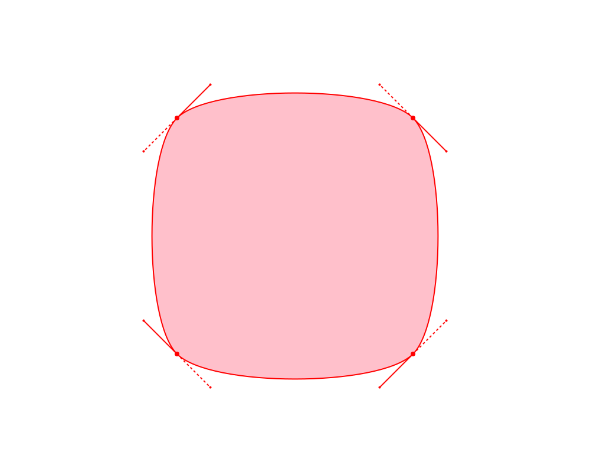

# blobs [](https://www.npmjs.com/package/blobs)

> random svg blob generator

## Install

```shell
$ npm install blobs
```

## Usage



```typescript
import blobs form "blobs";

const svg = blobs({
    size: 300,
    complexity: 0.4,
    contrast: 0.4,
    color: "pink",
    stroke: {
        color: "red",
        width: 2,
    },
    guides: true,
});
```

## Options

### Required

| Name           | Type       | Description                                   |
| -------------- | ---------- | --------------------------------------------- |
| `size`         | `number`   | Bounding box dimensions (in pixels)           |
| `complexity`   | `number`   | Shape complexity (number of points)           |
| `contrast`     | `number`   | Shape contrast (randomness of point position) |


### Optional

| Name           | Type       | Default    | Description                                   |
| -------------- | ---------- | ---------- | --------------------------------------------- |
| `color`        | `string?`  | `none`     | Fill color                                    |
| `stroke`       | `object?`  | `...`      | Stroke options                                |
| `stroke.color` | `string`   | `none`     | Stroke color                                  |
| `stroke.width` | `number`   | `0`        | Stroke width (in pixels)                      |
| `seed`         | `string?`  | _`random`_ | Value to seed random number generator         |
| `guides`       | `boolean?` | `false`    | Render points, handles and stroke             |

_Guides will use stroke color and width if defined. Otherwise, they default to `black` stroke with `1` width._

## License

[MIT](./LICENSE)
